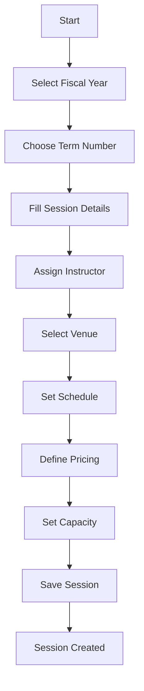
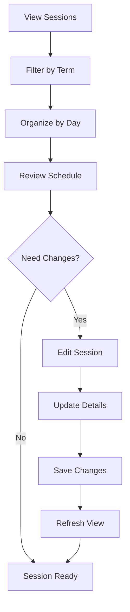

# Sessions Management System Documentation

## Overview

The Sessions Management System is a comprehensive solution for managing recurring exercise classes and fitness sessions within the Bolt Share platform. It provides a structured approach to organizing classes by terms, venues, instructors, and exercise types, with support for enrollment management and booking systems.

## Table of Contents

1. [System Architecture](#system-architecture)
2. [Database Schema](#database-schema)
3. [Core Components](#core-components)
4. [Use Cases](#use-cases)
5. [Workflows](#workflows)
6. [Features](#features)
7. [Technical Implementation](#technical-implementation)
8. [Integration Points](#integration-points)

## System Architecture

### Core Entities

The sessions system is built around several interconnected entities:

- **Sessions**: Recurring classes with defined schedules
- **Terms**: Academic/fiscal periods (4 terms per year)
- **Venues**: Physical locations where sessions are held
- **Instructors**: Staff members who conduct sessions
- **Exercise Types**: Categories of exercise activities
- **Enrollments**: Customer registrations for sessions
- **Enrollment Sessions**: Individual session bookings within enrollments

### Data Flow

```
Terms → Sessions → Enrollment Sessions → Bookings
  ↓         ↓              ↓              ↓
Venues   Instructors   Customers     Payments
  ↓         ↓              ↓              ↓
Exercise Types → Session Management → Reporting
```

## Database Schema

### Sessions Table

```sql
CREATE TABLE public.sessions (
  id uuid NOT NULL DEFAULT gen_random_uuid(),
  name text NOT NULL,                    -- Session name (e.g., "Aqua Fitness")
  code text NOT NULL,                    -- Session code (e.g., "AF001")
  venue_id uuid NOT NULL REFERENCES venues(id),
  instructor_id uuid NOT NULL REFERENCES instructors(id),
  fee_criteria text NOT NULL,            -- Fee description
  term text NOT NULL,                    -- Term1, Term2, Term3, Term4
  fee_amount numeric(10, 2) NOT NULL DEFAULT 0.00,
  exercise_type_id uuid REFERENCES exercise_types(id),
  term_id bigint REFERENCES terms(id),
  zip_code text,
  day_of_week text NOT NULL,             -- Monday, Tuesday, etc.
  start_time time WITHOUT TIME ZONE NOT NULL,
  end_time time WITHOUT TIME ZONE,
  is_subsidised boolean DEFAULT false,
  class_capacity bigint,                 -- NULL for unlimited
  created_at timestamp with time zone DEFAULT now(),
  updated_at timestamp with time zone DEFAULT now(),
  
  CONSTRAINT sessions_day_of_week_check 
    CHECK (day_of_week IN ('Monday', 'Tuesday', 'Wednesday', 'Thursday', 'Friday', 'Saturday'))
);
```

### Enrollment Sessions Table

```sql
CREATE TABLE public.enrollment_sessions (
  id uuid NOT NULL DEFAULT gen_random_uuid(),
  enrollment_id uuid NOT NULL REFERENCES enrollments(id),
  session_id uuid NOT NULL REFERENCES sessions(id),
  booking_date date NOT NULL,
  is_free_trial boolean NOT NULL DEFAULT false,
  cancellation_reason text,
  medical_certificate_url text,
  cancellation_status text,              -- pending, accepted, rejected
  admin_notes text,
  trial_date date,
  partial_dates jsonb,                   -- Array of dates for partial enrollments
  enrollment_type character varying,     -- full, trial, partial
  created_at timestamp with time zone DEFAULT now(),
  updated_at timestamp with time zone DEFAULT now()
);
```

## Core Components

### 1. Sessions Management Page (`/dashboard/sessions`)

**File**: `app/dashboard/sessions/page.tsx`

**Purpose**: Main interface for viewing and managing all sessions

**Key Features**:
- **Term-based Filtering**: Filter sessions by fiscal year and term number
- **Day-wise Organization**: Sessions grouped by day of the week
- **Comprehensive Display**: Shows time, code, name, venue, instructor, capacity, and fees
- **Inline Editing**: Quick edit functionality for session details
- **Real-time Updates**: Automatic refresh after changes

**Interface Elements**:
```typescript
interface Session {
  id: string;
  name: string;
  code: string;
  venue_id: string;
  instructor_id: string;
  fee_criteria: string;
  term: string;
  fee_amount: number;
  exercise_type_id: string | null;
  term_id: number;
  zip_code: string | null;
  day_of_week: DayOfWeek;
  start_time: string;
  end_time: string | null;
  is_subsidised: boolean;
  class_capacity: number | null;
  // Related data
  term_details?: { fiscal_year: number; start_date: string; end_date: string; };
  instructor?: { name: string; contact_no: string; };
  exercise_type?: { name: string; };
  venue?: { name: string; street_address: string; city: string; };
}
```

### 2. Session Form Component

**File**: `app/dashboard/sessions/components/session-form.tsx`

**Purpose**: Create and edit session details

**Features**:
- **Dual Mode**: Create new sessions or edit existing ones
- **Comprehensive Fields**: All session attributes with validation
- **Dynamic Relationships**: Links to venues, instructors, exercise types
- **Term Management**: Automatic term selection based on fiscal year
- **Validation**: Zod schema validation for all inputs

**Form Fields**:
- Session name and code
- Venue selection (active venues only)
- Instructor assignment
- Exercise type (optional)
- Day of week and time slots
- Fee structure and criteria
- Capacity limits
- Subsidization status

## Use Cases

### 1. Session Planning and Scheduling

**Scenario**: Fitness center needs to plan classes for the upcoming term

**Process**:
1. **Term Selection**: Choose fiscal year and term (1-4)
2. **Session Creation**: Create recurring sessions with:
   - Fixed day and time slots
   - Assigned instructors
   - Venue allocation
   - Exercise type categorization
3. **Capacity Planning**: Set class limits or unlimited capacity
4. **Pricing Structure**: Define fees and subsidization options

**Benefits**:
- Structured approach to class scheduling
- Clear instructor and venue assignments
- Consistent pricing across terms
- Easy replication for future terms

### 2. Customer Enrollment Management

**Scenario**: Customers want to enroll in fitness sessions

**Process**:
1. **Session Discovery**: Customers browse available sessions by:
   - Day of week
   - Exercise type
   - Venue location
   - Instructor
2. **Enrollment Types**:
   - **Full Enrollment**: Complete term participation
   - **Trial Enrollment**: Single session trial
   - **Partial Enrollment**: Selected dates only
3. **Payment Processing**: Integrated with Stripe
4. **Booking Confirmation**: Automatic enrollment session creation

**Benefits**:
- Flexible enrollment options
- Automated booking system
- Payment integration
- Trial class support

### 3. Instructor Workload Management

**Scenario**: Managing instructor schedules and assignments

**Process**:
1. **Session Assignment**: Link instructors to specific sessions
2. **Schedule Overview**: View all sessions by instructor
3. **Capacity Management**: Monitor class sizes
4. **Conflict Resolution**: Prevent double-booking

**Benefits**:
- Clear instructor responsibilities
- Workload distribution
- Schedule optimization
- Conflict prevention

### 4. Venue Utilization Tracking

**Scenario**: Optimizing venue usage across multiple locations

**Process**:
1. **Venue Assignment**: Link sessions to specific venues
2. **Utilization Analysis**: Track venue usage by day/time
3. **Capacity Planning**: Ensure venue capacity matches class needs
4. **Geographic Distribution**: Balance sessions across locations

**Benefits**:
- Efficient venue utilization
- Geographic accessibility
- Capacity optimization
- Location-based planning

### 5. Financial Management

**Scenario**: Tracking revenue and managing subsidized programs

**Process**:
1. **Fee Structure**: Define session pricing
2. **Subsidization**: Mark sessions as subsidized
3. **Revenue Tracking**: Monitor enrollment-based income
4. **Financial Reporting**: Generate term-based reports

**Benefits**:
- Transparent pricing
- Subsidized program support
- Revenue tracking
- Financial planning

## Workflows

### Session Creation Workflow



### Enrollment Workflow

```mermaid
graph TD
    A[Customer Browses Sessions] --> B[Select Session(s)]
    B --> C[Choose Enrollment Type]
    C --> D{Enrollment Type}
    D -->|Trial| E[Select Trial Date]
    D -->|Partial| F[Select Specific Dates]
    D -->|Full| G[Complete Term]
    E --> H[Payment Processing]
    F --> H
    G --> H
    H --> I[Create Enrollment]
    I --> J[Create Enrollment Sessions]
    J --> K[Confirmation]
```

### Session Management Workflow



## Features

### 1. Term-Based Organization

- **Fiscal Year Management**: Organize sessions by fiscal years
- **Term Structure**: 4 terms per year (Term1, Term2, Term3, Term4)
- **Current Term Detection**: Automatic selection of current term
- **Historical Data**: Access to previous terms

### 2. Flexible Scheduling

- **Recurring Sessions**: Weekly recurring class schedules
- **Time Slots**: Configurable start and end times
- **Day Selection**: Monday through Saturday support
- **Capacity Limits**: Unlimited or specific capacity settings

### 3. Multi-Venue Support

- **Venue Management**: Multiple venue locations
- **Geographic Distribution**: Sessions across different areas
- **Venue Status**: Active/inactive venue management
- **Address Information**: Complete venue details

### 4. Instructor Management

- **Instructor Assignment**: Link instructors to sessions
- **Contact Information**: Instructor details and contact numbers
- **Workload Distribution**: Balance instructor assignments
- **Schedule Visibility**: Instructor-specific session views

### 5. Exercise Type Categorization

- **Exercise Categories**: Categorize sessions by exercise type
- **Optional Assignment**: Sessions can have exercise types or be generic
- **Type-based Filtering**: Filter sessions by exercise category
- **Description Support**: Detailed exercise type information

### 6. Financial Management

- **Fee Structure**: Configurable session fees
- **Subsidization**: Support for subsidized programs
- **Fee Criteria**: Detailed fee descriptions
- **Payment Integration**: Stripe payment processing

### 7. Enrollment Flexibility

- **Multiple Enrollment Types**:
  - Full term enrollment
  - Trial class enrollment
  - Partial date enrollment
- **Date Selection**: Flexible date picking for trials and partial enrollments
- **Payment Options**: Various payment methods
- **Booking Management**: Comprehensive booking system

### 8. Cancellation Management

- **Cancellation Requests**: Customer-initiated cancellations
- **Admin Approval**: Administrative review process
- **Medical Certificates**: Support for medical documentation
- **Status Tracking**: Pending, accepted, rejected statuses

## Technical Implementation

### Frontend Architecture

**Technology Stack**:
- **Framework**: Next.js 14 with App Router
- **UI Library**: Radix UI with custom components
- **State Management**: React hooks and context
- **Form Handling**: React Hook Form with Zod validation
- **Styling**: Tailwind CSS

**Key Patterns**:
- **Component Composition**: Reusable UI components
- **Form Validation**: Zod schema validation
- **Error Handling**: Comprehensive error management
- **Loading States**: User-friendly loading indicators
- **Responsive Design**: Mobile-first approach

### Backend Integration

**Database**: Supabase (PostgreSQL)
- **Real-time Updates**: Supabase real-time subscriptions
- **Row Level Security**: Comprehensive security policies
- **Foreign Key Constraints**: Data integrity enforcement
- **Indexing**: Optimized query performance

**API Integration**:
- **Stripe Payments**: Payment processing
- **File Upload**: Medical certificate storage
- **Email Notifications**: Automated communications

### Data Validation

**Zod Schema**:
```typescript
const sessionFormSchema = z.object({
  name: z.string().min(1, 'Name is required'),
  code: z.string().min(1, 'Code is required'),
  venue_id: z.string().uuid('Invalid venue ID'),
  instructor_id: z.string().uuid('Invalid instructor ID'),
  fee_criteria: z.string().min(1, 'Fee criteria is required'),
  term: z.string().min(1, 'Term is required'),
  fee_amount: z.number().min(0, 'Fee amount must be positive'),
  exercise_type_id: z.string().uuid('Invalid exercise type ID').nullable(),
  term_id: z.number().int('Invalid term ID'),
  zip_code: z.string().nullable(),
  day_of_week: z.enum(['Monday', 'Tuesday', 'Wednesday', 'Thursday', 'Friday', 'Saturday']),
  start_time: z.string().min(1, 'Start time is required'),
  end_time: z.string().nullable(),
  is_subsidised: z.boolean().default(false),
  class_capacity: z.number().int().nullable(),
});
```

## Integration Points

### 1. Customer Management

- **Customer Profiles**: Link enrollments to customer records
- **Customer History**: Track enrollment history
- **Customer Preferences**: Store customer preferences and requirements

### 2. Payment Processing

- **Stripe Integration**: Secure payment processing
- **Payment Tracking**: Monitor payment status
- **Receipt Generation**: Automatic receipt creation
- **Refund Management**: Handle payment refunds

### 3. Communication System

- **Email Notifications**: Automated enrollment confirmations
- **SMS Reminders**: Class reminders and updates
- **Admin Notifications**: Staff notifications for changes

### 4. Reporting and Analytics

- **Enrollment Reports**: Term-based enrollment statistics
- **Revenue Reports**: Financial performance tracking
- **Attendance Reports**: Class attendance monitoring
- **Utilization Reports**: Venue and instructor utilization

### 5. Mobile Application

- **Session Discovery**: Mobile-friendly session browsing
- **Enrollment Management**: Mobile enrollment process
- **Schedule Viewing**: Personal schedule access
- **Notifications**: Push notifications for updates

## Best Practices

### 1. Session Planning

- **Advance Planning**: Create sessions well before term start
- **Capacity Planning**: Consider venue capacity and demand
- **Instructor Availability**: Confirm instructor schedules
- **Geographic Distribution**: Balance sessions across venues

### 2. Enrollment Management

- **Clear Communication**: Provide clear enrollment instructions
- **Flexible Options**: Offer multiple enrollment types
- **Payment Clarity**: Transparent pricing and payment terms
- **Confirmation Process**: Clear enrollment confirmations

### 3. Data Management

- **Regular Backups**: Maintain regular data backups
- **Data Validation**: Implement comprehensive validation
- **Audit Trails**: Track all changes and modifications
- **Performance Optimization**: Monitor and optimize queries

### 4. User Experience

- **Intuitive Interface**: User-friendly design
- **Responsive Design**: Mobile and desktop compatibility
- **Loading States**: Clear loading indicators
- **Error Handling**: Helpful error messages

## Future Enhancements

### 1. Advanced Scheduling

- **Waitlist Management**: Handle session capacity overflow
- **Session Conflicts**: Prevent scheduling conflicts
- **Recurring Patterns**: More complex recurring schedules
- **Holiday Management**: Automatic holiday adjustments

### 2. Enhanced Analytics

- **Predictive Analytics**: Demand forecasting
- **Performance Metrics**: Instructor and venue performance
- **Customer Insights**: Enrollment pattern analysis
- **Financial Analytics**: Advanced financial reporting

### 3. Mobile Features

- **Mobile App**: Native mobile application
- **Offline Support**: Offline session viewing
- **Push Notifications**: Real-time updates
- **QR Code Check-in**: Attendance tracking

### 4. Integration Enhancements

- **Calendar Integration**: External calendar sync
- **Social Media**: Social sharing features
- **Third-party APIs**: Additional service integrations
- **API Access**: Public API for external integrations

## Conclusion

The Sessions Management System provides a comprehensive solution for managing fitness classes and enrollments. Its modular architecture, flexible enrollment options, and robust data management make it suitable for fitness centers of various sizes. The system's integration with payment processing, customer management, and reporting tools creates a complete ecosystem for fitness business operations.

The system's emphasis on user experience, data integrity, and scalability ensures it can grow with the business while maintaining high performance and reliability. Regular updates and enhancements will continue to improve functionality and user satisfaction. 